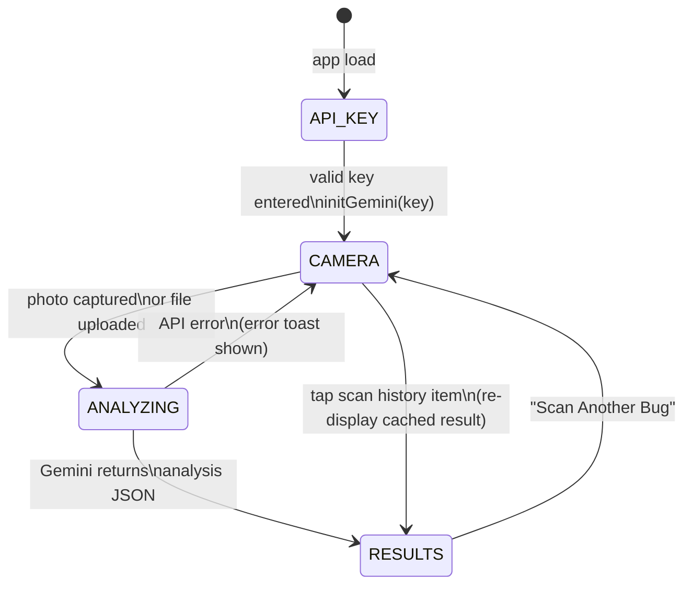
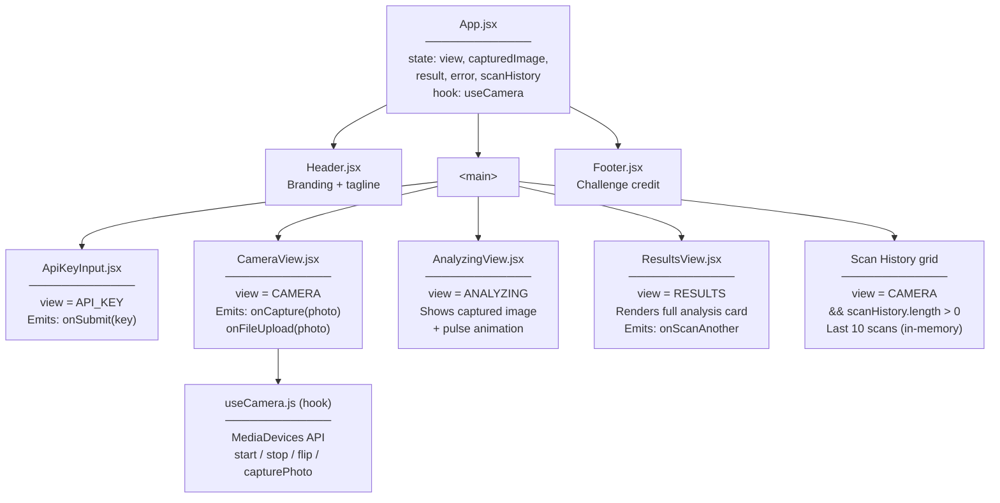
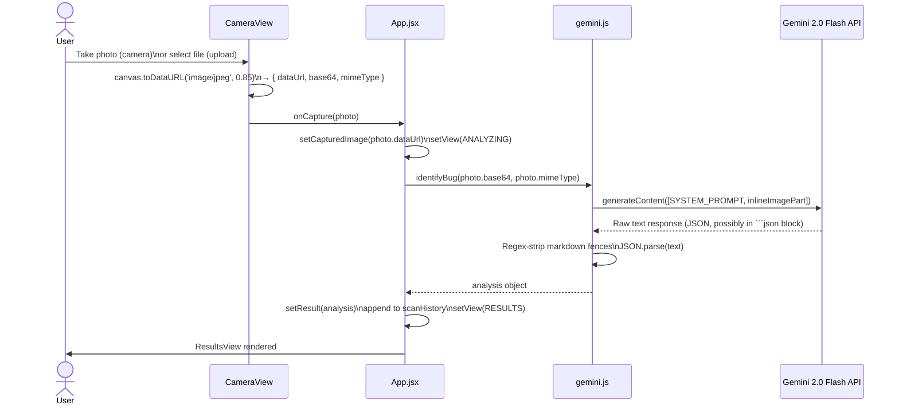

# 🐛 EarthBug — *helps build the soil*

> Snap a bug. Discover its secret life in your garden's ecosystem.

**EarthBug** is a web app that lets you photograph any bug you find and instantly learn how it helps (or harms) your plants and soil. Built with React and powered by Google Gemini's vision AI.

🌍 Built for the [DEV Weekend Challenge: Earth Day Edition](https://dev.to/challenges/weekend-2026-04-16)

## What It Does

1. **Snap or upload** a photo of any bug you find
2. **Gemini AI identifies** the insect and analyzes its ecological role
3. **Get a verdict** — Garden Buddy (helpful), Garden Bully (harmful), or It's Complicated
4. **Learn the details** — benefits to soil & plants, potential harms, ecosystem role, and a fun fact

## Tech Stack

- **React** + **Vite** — fast, modern frontend
- **Google Gemini 2.0 Flash** — multimodal AI for bug identification
- **Tailwind CSS** — earthy, natural styling
- **MediaDevices API** — browser camera access

## Getting Started

### Prerequisites

- Node.js 18+
- A [Google Gemini API key](https://aistudio.google.com/apikey) (free tier available)

### Install & Run

```bash
# Clone the repo
git clone https://github.com/YOUR_USERNAME/earthbug.git
cd earthbug

# Install dependencies
npm install

# Start dev server
npm run dev
```

Open [http://localhost:5173](http://localhost:5173) and enter your Gemini API key when prompted.

### Build for Production

```bash
npm run build
npm run preview
```

## How It Works

EarthBug uses Google Gemini's multimodal capabilities to analyze bug photos. When you snap or upload a photo:

1. The image is sent to Gemini 2.0 Flash with a specialized entomology prompt
2. Gemini identifies the insect and returns structured data about its ecological impact
3. The app renders the results in a friendly, informative card layout

Your API key stays in your browser — it's never sent to any server other than Google's API.

---

## Architecture

### App State Machine

The UI is driven by a single `view` enum in `App.jsx`. Every transition is deterministic.



### Component Tree



### Data Flow: Photo → Gemini → Result



### Gemini Response Schema

`gemini.js` enforces this structure via the system prompt. The UI renders each field:

```
{
  name:           string       → hero card title
  scientificName: string       → hero card subtitle (italic)
  verdict:        "Garden Buddy" | "Garden Bully" | "It's Complicated"
  confidence:     "high" | "medium" | "low"   → top-right badge
  summary:        string       → paragraph below verdict badge
  benefits:       { title, description }[]    → "How It Helps" section
  harms:          { title, description }[]    → "Potential Harms" section
  ecosystemRole:  string       → "Ecosystem Role" card
  didYouKnow:     string       → "Did You Know?" card
  soilImpact:     "positive" | "negative" | "neutral"  → impact row
  plantImpact:    "positive" | "negative" | "neutral"  → impact row
}
```

Error shape (no bug detected):
```
{ error: true, message: string }
```

### File Structure

```
earthbug/
├── index.html                  # Entry point — Google Fonts, viewport, OG tags
├── vite.config.js              # Vite + React plugin
├── tailwind.config.js          # Custom palette: earth / leaf / soil
├── postcss.config.js
├── public/
│   └── favicon.svg
└── src/
    ├── main.jsx                # React root mount
    ├── index.css               # Tailwind layers + .card, .btn-primary, .btn-secondary
    │                           # @keyframes: scan-line, gentle-pulse
    ├── App.jsx                 # Root component — state machine + scan history
    ├── components/
    │   ├── Header.jsx          # Logo + tagline (pure presentational)
    │   ├── Footer.jsx          # Challenge attribution (pure presentational)
    │   ├── ApiKeyInput.jsx     # Controlled form — emits key string upward
    │   ├── CameraView.jsx      # Camera viewfinder OR upload zone
    │   ├── AnalyzingView.jsx   # Loading state (image preview + pulse dots)
    │   └── ResultsView.jsx     # Full analysis display (verdict, benefits, harms…)
    ├── hooks/
    │   └── useCamera.js        # MediaDevices wrapper — start/stop/flip/capturePhoto
    └── utils/
        └── gemini.js           # Gemini SDK init + identifyBug() call
```

## Prize Category

This project uses **Google Gemini** for the "Best use of Google Gemini" prize category.

## License

MIT
